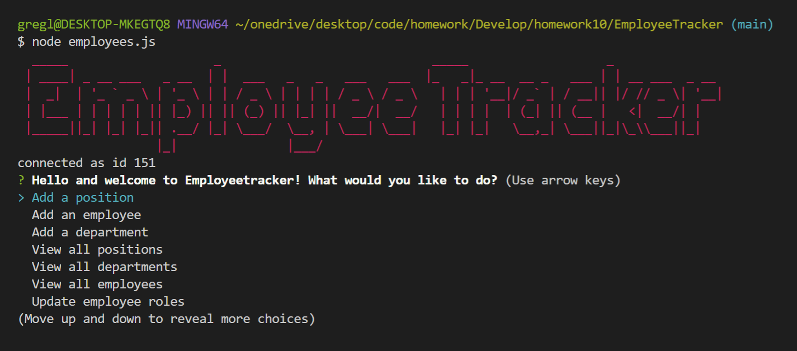
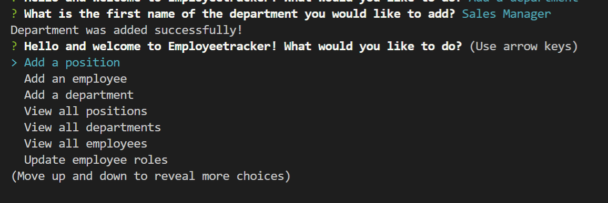
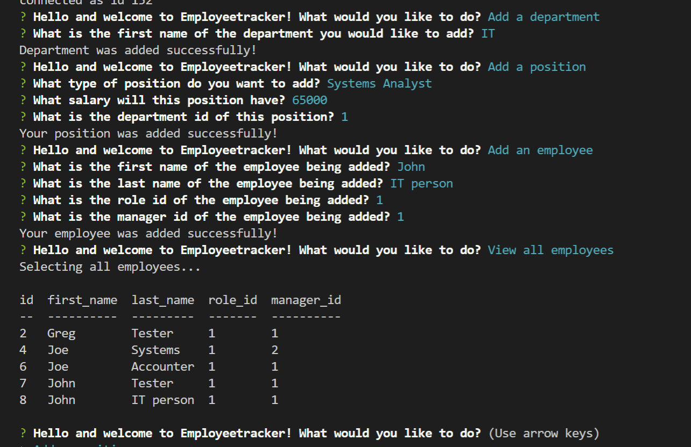
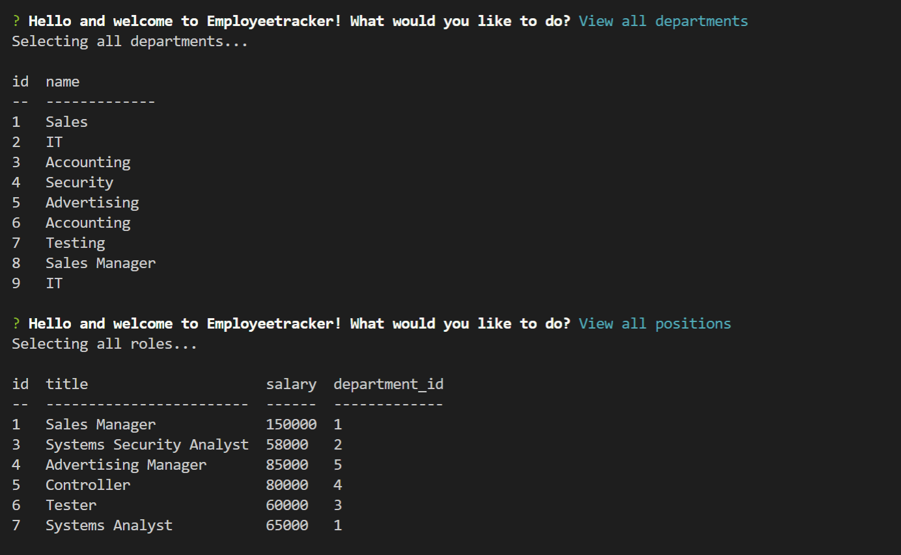
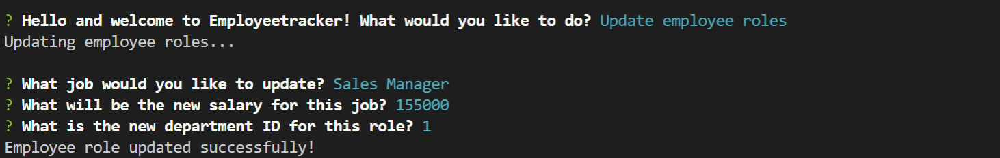
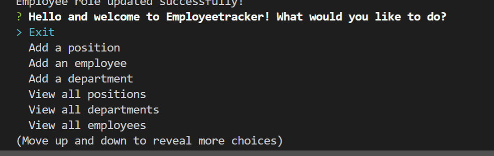

# EmployeeTracker

     
 ## Table of Contents 

- [Description](#Description)

- [Installation](##Installation)

- [Information](##Information)

- [Contribute](##Contribute)

- [Testing](##Testing)

- [Contribute](##Contribute)

- [Licensing](###Licensing)
         
    
 ## Description:
    
EmployeeTracker is an applicatoin where a business owner can input entire departments, job roles, and employee information in a database and update this information regularly from the command line. It is run in JavaScript and nodeJS, in addition to being connected to a mySQL database. Whenever there is a change in employee roles, such as a promotion or an increase in salary, this can also be added in EmployeeTracker. A prompt with various options is offered to the user, and they can repeatedly navigate to whatever area that they desire to go to, input their information, and it will be added to a mySQL database. 

If you've got the proper dependencies installed, you should be greeted with the following image in your terminal and prompted with a series of options and the display of the application:

1.) 

2.) 

3.) 

4.) 

5.) 

6.) 

Also, make sure to watch the video link, which will demonstrate the functionality of the application with the mySQL database.
### Video link: 
https://drive.google.com/file/d/1N5VLuZFXxTiVJvBSZp0YQRpF8TYUGmy_/view
    
 ## Installation      
 To run this application successfully, make sure to install `inquirer`, `chalk`, `figlet`, `mysql`, `console.table`. Don't forget to run an `npm init` to get started. If everything plays nice, you will see the prompt shown in image 1.

    
 ## Information
    
 See install instructions for using EmployeeTracker. 

    
 ## Email
    
 gregjleighton@gmail.com

    
 ## GitHub
    
 https://github.com/preussenfahrer/EmployeeTrackerpreussenfahrer
          
    
 ## Contribute
    
 To contribute to EmployeeTracker, please feel free to fork the repository or to contact me at the email listed here in the ReadMe.
    
   
 ## Testing
    
 To test that EmployeeTracker is working, make sure to first and foremost run npm init and ensure that you have a package.json that lists your dependencies. Also make sure to run the schema here in your mySQL and do some test positions to add into your database.
    
   
 ## Licensing
    
 Public Domain
